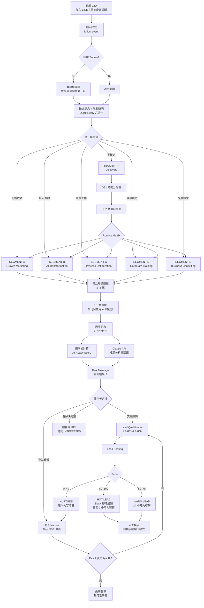

# 02｜全流程 Flowchart、State Machine 與 Question Tree

## 1. 全流程 Flowchart



---

## 2. State Machine

`users.current_state` 單一欄位驅動整個流程。每收到一個 event，先讀 state，再決定怎麼處理。

### 2.1 狀態清單

| State | 意義 | 下一個 event 預期 | 逾時處理 |
|---|---|---|---|
| `NEW` | 剛加好友，尚未發歡迎訊息 | — | — |
| `SEG_SELECT` | 已發歡迎訊息，等待選 Segment | postback `seg` | 24hr 後發一次提醒 |
| `Q_GM_1` ~ `Q_GM_3` | Growth Marketing 問答中 | postback `ans` | 48hr 後標記 `ABANDONED` |
| `Q_AX_1` ~ `Q_AX_3` | AI Transformation 問答中 | postback `ans` | 同上 |
| `Q_PO_1` ~ `Q_PO_2` | Process Optimization 問答中 | postback `ans` | 同上 |
| `Q_CT_1` ~ `Q_CT_3` | Corporate Training 問答中 | postback `ans` | 同上 |
| `Q_BC_1` ~ `Q_BC_2` | Business Consulting 問答中 | postback `ans` | 同上 |
| `Q_DS_1` ~ `Q_DS_2` | Discovery 分流中 | postback `ans` | 同上 |
| `Q_U_1` | 共用題（AI 成熟度） | postback `ans` | 同上 |
| `DIAG_GENERATING` | LLM 分析中 | 系統內部 | 60 秒未完成 → 降級輸出 |
| `DIAG_SENT` | 診斷結果已送出 | postback `cta` | 進 Follow-up 排程 |
| `LEAD_1` ~ `LEAD_8` | 收集聯絡資訊中 | postback 或 text | 24hr 後提醒一次 |
| `LEAD_DONE` | 資料收集完成 | — | 觸發 Scoring |
| `HANDOFF` | 已轉真人，機器人停止自動回覆 | 人工 | — |
| `NURTURE` | 培養名單 | Follow-up 排程 | — |
| `ABANDONED` | 中途離開超過 48 小時 | 任何 event → 詢問是否續測 | — |

### 2.2 狀態轉移規則

```
NEW ──follow──► SEG_SELECT
SEG_SELECT ──seg=GM──► Q_GM_1 ──► Q_GM_2 ──► Q_GM_3 ──► Q_U_1 ──► DIAG_GENERATING
SEG_SELECT ──seg=AX──► Q_AX_1 ──► Q_AX_2 ──► Q_AX_3 ──────────► DIAG_GENERATING
SEG_SELECT ──seg=PO──► Q_PO_1 ──► Q_PO_2 ──► Q_U_1 ───────────► DIAG_GENERATING
SEG_SELECT ──seg=CT──► Q_CT_1 ──► Q_CT_2 ──► Q_CT_3 ──► Q_U_1 ─► DIAG_GENERATING
SEG_SELECT ──seg=BC──► Q_BC_1 ──► Q_BC_2 ──► Q_U_1 ───────────► DIAG_GENERATING
SEG_SELECT ──seg=DS──► Q_DS_1 ──► Q_DS_2 ──► [路由到某 Segment 的 Q1] ──► Q_U_1 ──► DIAG_GENERATING

DIAG_GENERATING ──LLM 完成──► DIAG_SENT
DIAG_SENT ──cta=consult──► LEAD_1 ──► ... ──► LEAD_8 ──► LEAD_DONE ──► HANDOFF
DIAG_SENT ──cta=solutions──► DIAG_SENT（標記 INTERESTED，排 Follow-up）
DIAG_SENT ──cta=later──► NURTURE
任何狀態 ──unfollow──► 保留資料 30 天後匿名化
```

**重要：AX 路徑不需要 U1**，因為 AX1 本身就是 AI 成熟度題。這讓最想談 AI 的人問題數最少。

### 2.3 問題數統計

| Segment | 題數（含共用題） | 預估耗時 |
|---|---|---|
| A Growth Marketing | 4 | 50 秒 |
| B AI Transformation | 3 | 40 秒 |
| C Process Optimization | 3 | 40 秒 |
| D Corporate Training | 4 | 50 秒 |
| E Business Consulting | 3 | 40 秒 |
| F Discovery | 4（2 分流 + 1 主題 + 1 共用） | 55 秒 |

全部控制在 4 題以內。承諾 60 秒就要做到 60 秒。

---

## 3. Question Tree

### 3.0 Postback Data 格式

```
type=ans&q={QID}&v={VALUE}
type=seg&v={SEGMENT_CODE}
type=cta&v={consult|solutions|later}
type=lead&q={LEAD_QID}&v={VALUE}
type=sys&v={restart|resume|privacy}
```

全部小寫短代碼，確保在 300 bytes 內。`sid`（session id）不放在 postback，改由後端用 `line_user_id + 最新未完成 session` 查出來，避免資料過長與偽造。

---

### SEGMENT 選擇（第一層）

**State:** `SEG_SELECT`

| Label（≤20 字元） | Value | 導向 |
|---|---|---|
| 📈 行銷成效不穩定 | `GM` | Growth Marketing |
| 🤖 想導入 AI 沒方向 | `AX` | AI Transformation |
| ⚙️ 團隊重複工作太多 | `PO` | Process Optimization |
| 👥 想提升團隊能力 | `CT` | Corporate Training |
| 🧠 品牌經營卡住 | `BC` | Business Consulting |
| ❓ 還不確定問題在哪 | `DS` | Discovery |

---

### SEGMENT A｜Growth Marketing

**GM1（State `Q_GM_1`）** 這半年你最想把哪個數字做起來？

| Label | Value |
|---|---|
| 曝光量 | `awareness` |
| 網站流量 | `traffic` |
| 名單數 | `leads` |
| 營業額 | `revenue` |
| 品牌知名度 | `brand` |
| 都想，但沒排序 | `unsure` |

**GM2（State `Q_GM_2`）** 目前實際有在跑的有哪些？

| Label | Value |
|---|---|
| Meta 廣告 | `meta` |
| Google 廣告 | `google` |
| SEO | `seo` |
| 社群經營 | `social` |
| LINE 行銷 | `line` |
| 以上都有在做 | `all` |
| 幾乎沒有 | `none` |

**GM3（State `Q_GM_3`）** 最卡的是哪一件？

| Label | Value |
|---|---|
| 成效忽高忽低 | `unstable` |
| 廣告成本一直漲 | `cost_up` |
| 有流量沒轉換 | `no_conversion` |
| 看不懂數據 | `no_data` |
| 沒有整體策略 | `no_strategy` |
| 沒有人專職在做 | `no_owner` |

→ `Q_U_1`

---

### SEGMENT B｜AI Transformation

**AX1（State `Q_AX_1`）** 公司現在用 AI 到什麼程度？

| Label | Value | Level |
|---|---|---|
| 幾乎沒在用 | `L0` | 0 |
| 偶爾用 ChatGPT | `L1` | 1 |
| 員工各自在用 | `L2` | 2 |
| 開始建工作流程 | `L3` | 3 |
| 已有自動化在跑 | `L4` | 4 |
| 已有內部 AI 系統 | `L5` | 5 |

**AX2（State `Q_AX_2`）** 最想先讓 AI 接手哪一塊？

| Label | Value |
|---|---|
| 內容產出 | `content` |
| 客服回覆 | `service` |
| 行政文書 | `admin` |
| 業務開發 | `sales` |
| 行銷投放 | `marketing` |
| 管理與報表 | `mgmt` |
| 資料整理 | `data` |

**AX3（State `Q_AX_3`）** 目前最大的卡點是什麼？

| Label | Value |
|---|---|
| 不知道用在哪 | `no_usecase` |
| 員工不會用 | `no_skill` |
| 公司資料很亂 | `messy_data` |
| 沒有標準流程 | `no_process` |
| 工具多但沒整合 | `no_integration` |
| 算不出 ROI | `no_roi` |

→ `DIAG_GENERATING`（AX 路徑跳過 U1）

---

### SEGMENT C｜Process Optimization

**PO1（State `Q_PO_1`）** 哪一類工作最吃掉團隊時間？

| Label | Value |
|---|---|
| 資料整理 | `data` |
| 做報表 | `report` |
| 客服回覆 | `service` |
| 內容產出 | `content` |
| 開會 | `meeting` |
| 寫文件 | `doc` |
| 追進度 | `tracking` |
| 跨部門溝通 | `crossdept` |

**PO2（State `Q_PO_2`）** 這件事整個團隊每週大概花多少小時？

| Label | Value | 週工時 |
|---|---|---|
| 3 小時以內 | `lt3` | 2 |
| 3–10 小時 | `3to10` | 6.5 |
| 10–30 小時 | `10to30` | 20 |
| 30 小時以上 | `gt30` | 40 |

→ `Q_U_1`

---

### SEGMENT D｜Corporate Training

**CT1（State `Q_CT_1`）** 這次想訓練的對象是誰？

| Label | Value |
|---|---|
| 主管層 | `manager` |
| 行銷團隊 | `marketing` |
| 業務團隊 | `sales` |
| 行政與內勤 | `admin` |
| 全體員工 | `all` |

**CT2（State `Q_CT_2`）** 大概多少人？

| Label | Value |
|---|---|
| 1–10 人 | `1to10` |
| 11–30 人 | `11to30` |
| 31–50 人 | `31to50` |
| 50 人以上 | `50plus` |

**CT3（State `Q_CT_3`）** 最想上的主題？

| Label | Value |
|---|---|
| AI 基礎應用 | `ai` |
| AI × 行銷 | `ai_mkt` |
| 數位行銷 | `digital` |
| 流程自動化 | `automation` |
| 品牌經營 | `brand` |
| SEO | `seo` |
| 短影音 | `shortvideo` |
| 團隊管理 | `mgmt` |

→ `Q_U_1`

---

### SEGMENT E｜Business Consulting

**BC1（State `Q_BC_1`）** 現在最想解決的是哪一件？

| Label | Value |
|---|---|
| 營收成長 | `revenue` |
| 品牌定位 | `brand` |
| 人才與團隊 | `talent` |
| 營運效率 | `efficiency` |
| 數位轉型 | `dx` |
| AI 導入 | `ai` |
| 管理制度 | `mgmt` |

**BC2（State `Q_BC_2`）** 公司現在在哪個階段？

| Label | Value |
|---|---|
| 剛起步 | `startup` |
| 成長中 | `growing` |
| 穩定經營 | `established` |
| 正在轉型 | `transformation` |

→ `Q_U_1`

---

### SEGMENT F｜Discovery

不要問「你的問題是什麼」。不知道問題在哪的人，問這個只會更卡。改問行為與感受。

**DS1（State `Q_DS_1`）** 如果明天整天沒有會議，你會先處理哪件事？

| Label | Value | 傾向 |
|---|---|---|
| 想辦法拉業績 | `revenue` | GM / BC |
| 整理內部流程 | `process` | PO |
| 好好想策略 | `strategy` | BC |
| 帶一下團隊 | `team` | CT |
| 做內容和行銷 | `content` | GM |
| 研究 AI 工具 | `ai` | AX |

**DS2（State `Q_DS_2`）** 公司現在比較接近哪一種狀態？

| Label | Value |
|---|---|
| 接不完但做不完 | `overloaded` |
| 做得完但接不到 | `underdemand` |
| 都還行但看不到下一步 | `plateau` |
| 幾乎老闆一個人在撐 | `solo` |

**Routing Matrix（DS1 × DS2 → Segment）**

| DS1 \ DS2 | overloaded | underdemand | plateau | solo |
|---|---|---|---|---|
| `revenue` | PO | GM | BC | GM |
| `process` | PO | PO | PO | AX |
| `strategy` | BC | BC | BC | BC |
| `team` | CT | CT | CT | CT |
| `content` | AX | GM | GM | AX |
| `ai` | AX | AX | AX | AX |

路由後**只問該 Segment 的第 1 題**，再接 `Q_U_1`。Discovery 路徑總題數維持 4 題。

---

### 共用題

**U1（State `Q_U_1`）** 最後一題。公司現在用 AI 到什麼程度？

選項與 AX1 完全相同（`L0`–`L5`）。

放在最後的理由：前面的問題讓使用者進入狀態，最後這題直接餵給評分模型，同時暗示接下來的輸出跟 AI 有關。

---

## 4. Quick Reply 設計規則

1. **一律用 postback，不用 message action。** Postback 可以帶結構化資料，不會被使用者手動輸入干擾。
2. **每個 postback 都設 `displayText`**，讓使用者在對話中看見自己的選擇，維持對話感。
3. **選項不超過 8 個。** 超過 8 個手機要橫向捲很久，完成率會掉。
4. **不要在 Quick Reply 放「返回上一題」。** 會把 State Machine 複雜度拉高三倍，且實測使用率低於 2%。要改答案的人，診斷完再給「重新診斷」。
5. **emoji 只放在第一層分流。** 第二層診斷題不放 emoji，語氣才會從「歡迎頁」轉成「顧問在問話」。
6. **最後一個選項永遠是「不確定 / 都想」那一類。** 不給退路的問卷，使用者會亂選，資料反而更髒。

### Quick Reply JSON 範例（第一層）

```json
{
  "type": "text",
  "text": "先從第一題開始。\n\n你現在最有感的是哪一件？",
  "quickReply": {
    "items": [
      { "type": "action", "action": { "type": "postback", "label": "📈 行銷成效不穩定", "data": "type=seg&v=GM", "displayText": "行銷成效不穩定" } },
      { "type": "action", "action": { "type": "postback", "label": "🤖 想導入 AI 沒方向", "data": "type=seg&v=AX", "displayText": "想導入 AI 但沒方向" } },
      { "type": "action", "action": { "type": "postback", "label": "⚙️ 團隊重複工作太多", "data": "type=seg&v=PO", "displayText": "團隊重複工作太多" } },
      { "type": "action", "action": { "type": "postback", "label": "👥 想提升團隊能力", "data": "type=seg&v=CT", "displayText": "想提升團隊能力" } },
      { "type": "action", "action": { "type": "postback", "label": "🧠 品牌經營卡住", "data": "type=seg&v=BC", "displayText": "品牌經營卡住" } },
      { "type": "action", "action": { "type": "postback", "label": "❓ 還不確定問題在哪", "data": "type=seg&v=DS", "displayText": "還不確定問題在哪" } }
    ]
  }
}
```
